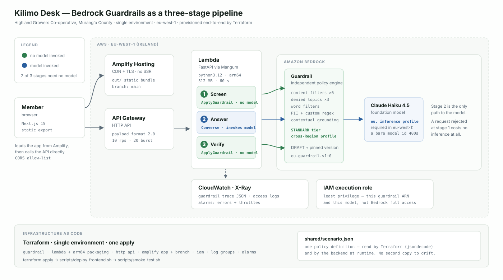

# Kilimo Desk — a hands-on Amazon Bedrock Guardrails demo

This repository contains two things: a **self-paced lab** you run on your own AWS
account in about 90 minutes for under $0.05, and a **60-minute presented demo** built
for the AWS AI/ML User Group Kenya. If you are here to learn Bedrock Guardrails
yourself, start with the lab — it needs one AWS resource and no Bedrock model access.
If you are here to present, the runbook is the timeline.

Both teach the same thing: a guardrail is not a checkbox on a model call. It is an
independent policy engine you can invoke on its own.

## Start here

| If you want to… | Go to | Time |
|---|---|---|
| **Check your install is correct** | `./scripts/verify-install.sh` | 2 min |
| **Check your AWS account will work** | [docs/aws-prerequisites.md](docs/aws-prerequisites.md) | 5 min |
| **Run the lab yourself** ← *start here* | [docs/lab-guide.md](docs/lab-guide.md) | 90 min |
| **Present the 60-minute session** | [docs/demo-runbook.md](docs/demo-runbook.md) | 60 min |
| **See what was measured** | [docs/results.md](docs/results.md) | 10 min read |
| **Know what it costs** | [docs/cost.md](docs/cost.md) | 3 min read |
| **Read the design decisions** | [ADR.md](ADR.md) | 20 min read |
| **Understand the UI** | [the two views](#the-two-views) | 2 min read |
| **Deploy the full stack** ⚠ *never applied* | [RUNNING.md](RUNNING.md) | 20 min |

**The lab is the path that is known to work.** All 15 of its checkpoints have been met
against live AWS ([V-20](docs/validation-log.md)), it creates one guardrail, and it needs
no Bedrock model access. **The deployed stack has never been stood up by anyone** —
`iam:CreateRole` is denied in the account this was built in, so no Lambda, API Gateway or
Amplify app created by this repository has ever existed ([V-29](docs/validation-log.md)).
Terraform validates, the bundle builds and the handler is tested offline; whether `apply`
completes is unknown. [RUNNING.md](RUNNING.md) opens with the full status.

From the session itself:
[the handout](assets/Amazon-Bedrock-Guardrails-Workshop-Handout.pdf) (3 pages — what each
policy does and where it stops) and [the event poster](assets/aws-aiml-kenya-meetup-poster.jpeg).

Before anything else, two commands. The first needs no AWS account at all:

```bash
./scripts/verify-install.sh         # 55 checks, no credentials, creates nothing

export AWS_REGION=eu-west-1         # or any Region where Bedrock Guardrails runs
python -m lab doctor                # creates nothing, tells you what is missing
```

`verify-install.sh` checks tools, dependencies, the shared contract, all four test suites,
Terraform, every documentation link and Replay_Mode. It reports **pass**, **fail** or
**skip**, and never counts a skip as a pass — so an unchecked prerequisite cannot look like
a satisfied one. Add `--with-aws` to fold in `lab doctor`, or `--quick` to skip the frontend
suites.

`lab doctor` distinguishes a permission you can grant from an organisation boundary you
cannot, and prints the exact fix for either. It exists because this project spent hours
confusing the two ([validation log V-09 to V-12](docs/validation-log.md)).

---

The app is **Kilimo Desk**, the member-support assistant for *Highland Growers
Co-operative*, a fictional smallholder farming co-operative in **Murang'a County**.
The domain is deliberate: a wrong answer here has consequences you can name out
loud. A bad chemical dose harms a crop, an animal, or a person.



- **[docs/aws-prerequisites.md](docs/aws-prerequisites.md)** — account setup, standalone and organisation
- **[docs/lab-guide.md](docs/lab-guide.md)** — the eight-module self-paced lab
- **[docs/results.md](docs/results.md)** — every measurement, with its record set
- **[docs/cost.md](docs/cost.md)** — what it costs, and how that is derived
- **[docs/validation-log.md](docs/validation-log.md)** — 35 entries: what was run against AWS, and the seventeen defects it found in committed code
- **[RUNNING.md](RUNNING.md)** — deploying the full stack
- **[ADR.md](ADR.md)** — architecture decisions, and the alternatives rejected
- **[docs/demo-runbook.md](docs/demo-runbook.md)** — the 60-minute presented session
- **[docs/further-reading.md](docs/further-reading.md)** — official samples, articles, docs

## The two views

The UI renders **one request twice**. The **Landing_Page** presents the co-operative with
an embedded **Chat_Window**, which is member-facing: it shows the answer or the refusal
and nothing else. The **Background_View** is engineer-facing and reveals, for that same
request, which policies fired and whether a model was invoked. The **Grounding_Tool**,
also engineer-facing, calls `POST /api/verify` directly so you can probe the thresholds.

The gap between the two views is the lesson. Its largest case is masking: the member asks
about a payment, gets an answer, and nothing looks unusual — while the Background_View
shows their name, phone number and member number were replaced before the model received
the text.

| Component | File | Audience |
|---|---|---|
| Landing_Page | [`frontend/src/app/page.tsx`](frontend/src/app/page.tsx) · [`LandingSections.tsx`](frontend/src/components/LandingSections.tsx) | member-facing |
| Chat_Window | [`frontend/src/components/ChatWindow.tsx`](frontend/src/components/ChatWindow.tsx) | member-facing |
| Background_View | [`frontend/src/components/BackgroundView.tsx`](frontend/src/components/BackgroundView.tsx) · [`StageEntry.tsx`](frontend/src/components/StageEntry.tsx) | engineer-facing |
| Grounding_Tool | [`frontend/src/components/GroundingTool.tsx`](frontend/src/components/GroundingTool.tsx) | engineer-facing |

The Chat_Window calls the API **directly from the browser**, because the frontend is a
static export serving no server-side code ([ADR decision 4](ADR.md)). The API performs
**no authentication**, so the Landing_Page presents no sign-in and implies none
([ADR decision 6](ADR.md)).

---

## The idea: guardrails as a three-stage pipeline

Most guardrail demos are a chat box with a policy attached. That teaches the wrong
mental model — it makes a guardrail look like a feature of the model. It isn't.
This demo splits the work into three stages, because the split *is* the lesson:

| Stage | API | Model invoked? | What it shows |
|---|---|---|---|
| **1 · Screen** | `ApplyGuardrail(source=INPUT)` | **no** | reject bad input before paying for inference |
| **2 · Answer** | `Converse` + `guardrailConfig` | yes | the convenience path when you're already on Bedrock |
| **3 · Verify** | `ApplyGuardrail(source=OUTPUT)` | **no** | is the answer grounded in the reference document? |

Two of three stages never invoke a foundation model. The same screening call could
front a self-hosted model or a third-party API, because evaluation is independent
of inference — and here that is demonstrated, not asserted.

The UI renders all three stages side by side, each reporting whether it called a
model and how long it took. Reject a request at stage 1 and you watch stages 2
and 3 grey out, having cost nothing.

## What's in the box

```
frontend/         Next.js 15 static export: the Landing_Page with its embedded
                  Chat_Window (member-facing), the Background_View and the
                  Grounding_Tool (engineer-facing)
backend/          FastAPI — runs under uvicorn locally, Lambda via Mangum deployed
                  app/fixtures/replay/ — responses recorded from live AWS, so the
                  whole pipeline runs with no credentials at all
lab/              the Lab_CLI — doctor, policy, evaluate, conformance, checkpoint,
                  latency, teardown. Calls ApplyGuardrail only; no model access
infrastructure/   Terraform — guardrail, Lambda, HTTP API, Amplify, IAM, alarms
shared/           scenario.json — one policy definition, read by Terraform and the app
results/          the JSONL every measured number in docs/results.md is computed from
scripts/          verify-install.sh · package-backend.sh · deploy-frontend.sh
                  smoke-test.sh · replay-check.sh · deploy-and-validate.sh
                  measure-tier-gap.py
docs/             lab guide, runbook, results, cost, validation log, diagram
```

The **Lab_Path** is `lab/` plus one guardrail: no Lambda, no API Gateway, no Amplify, and
no Bedrock model access. Two of the three pipeline stages never invoke a model, which is
what makes that possible.

| Path | What it is |
|---|---|
| [`shared/scenario.json`](shared/scenario.json) | **the policy** — persona, denied topics, PII rules, thresholds, reference bulletin. One file, no second copy. |
| [`backend/app/guardrails.py`](backend/app/guardrails.py) | **the mechanics** — `screen()`, `answer()`, `verify()` and assessment parsing |
| [`backend/app/main.py`](backend/app/main.py) | FastAPI routes and AWS error mapping |
| [`infrastructure/guardrail.tf`](infrastructure/guardrail.tf) | the guardrail, built from `scenario.json` with `dynamic` blocks |
| [`frontend/src/components/StageEntry.tsx`](frontend/src/components/StageEntry.tsx) | one pipeline stage in the UI |
| [`docs/architecture.svg`](docs/architecture.svg) | the diagram above — presentation-ready |

## Quick start

Full detail in **[RUNNING.md](RUNNING.md)**. The short version, after enabling
Claude Haiku 4.5 in Bedrock for **eu-west-1**:

```bash
cd infrastructure
cp terraform.tfvars.example terraform.tfvars
terraform init && terraform apply          # builds the Lambda bundle too

cd ..
./scripts/deploy-frontend.sh               # build Next.js, push to Amplify
./scripts/smoke-test.sh                    # verify end to end

terraform -chdir=infrastructure output frontend_url
```

## Policies configured

Five of the six policy types, chosen by the domain rather than to tour the product:

| Policy | Configuration | Why this one |
|---|---|---|
| **Denied topics** | `Agrochemical Dosing`, `Land Tenure Disputes`, `Credit Terms` | each maps to a real harm or a regulated activity, written as natural-language definitions rather than keyword lists |
| **Content filters** | 6 categories at HIGH on input, 5 on output — `PROMPT_ATTACK` has `output_strength: NONE` | baseline moderation |
| **Word filters** | 2 unannounced internal programme names + managed profanity list | leak prevention — a different job from topic denial |
| **Sensitive information** | `PHONE`, `NAME` → ANONYMIZE; custom regexes for a co-op member number and a Kenyan national ID | data minimisation at the boundary |
| **Contextual grounding** | grounding ≥ 0.7, relevance ≥ 0.7 | hallucination control |
| ~~Automated Reasoning~~ | not configured | needs a formal policy document; English-only; Region-limited. See [ADR decision 11](ADR.md) |

### PII masked before the model sees it

`ANONYMIZE` is the API's name for the console's *Mask*, and setting `input_action`
means the value is replaced **before the model receives it**. Send:

> I am Grace Wanjiku, member HG-004182, my number is 0722135790. How long after grading do I get paid?

Stage 1 reports three separate hits — `NAME`, `PHONE`, and the `Co-op Member
Number` regex — and shows the rewritten string that gets forwarded. The request is
**not blocked**; it continues with the personal data removed. Blocking and masking
are different tools, and this is the difference. It is also the shape of control
Kenya's Data Protection Act 2019 asks for: minimisation at the boundary, not
redaction bolted on afterwards.

**Every sample value is invented.** `Grace Wanjiku`, `HG-004182` and `0722135790` are
fictional, like the co-operative itself. **Do not enter real personal information** into
the chat window or the lab CLI: the API performs no authentication, and this is a demo.

**The custom regexes are blunt, and the national ID one deliberately so.** Its pattern is
`\b[0-9]{8}\b`, which matches **any** eight-digit run delimited by non-digits — a
quantity, a year range, an order number, a batch code. Send a prompt carrying both an ID
and a phone number:

> My national ID is 24518803 and my number is 0722135790.

and both are replaced, each with its own placeholder, while `NAME` reports `NONE` — a
policy that looked and allowed, not one that failed (measured —
[V-23](docs/validation-log.md)). The bluntness is left in place so you meet the cost of a
loose custom regex on a prompt you wrote, rather than reading a warning about one.

### Contextual grounding without a knowledge base

Grounding normally implies a RAG stack, which is why short demos skip it.
`ApplyGuardrail` takes the reference document inline, tagged with a qualifier:

```python
content=[
    {"text": {"text": bulletin,     "qualifiers": ["grounding_source"]}},
    {"text": {"text": question,     "qualifiers": ["query"]}},
    {"text": {"text": model_answer, "qualifiers": ["guard_content"]}},
]
```

Grounding and relevance are **independent** checks. The instructive case is an
answer that is factually correct *and* fully supported by the bulletin, yet still
fails — because it does not address the question asked. The UI's *Grounding check*
tab has one canned case for each outcome.

Both thresholds sit at **0.7**. Any check whose outcome depends on a live model answer
clearing that threshold is **probabilistic**, not deterministic: the same question can
produce a differently-worded answer that scores either side of 0.7. The three cases in the
*Grounding check* tab are canned answers precisely so the outcome is fixed — a live
member request through stage 3 carries no such guarantee.

## How the guardrail attaches to a model call

Stage 2, in [`backend/app/guardrails.py`](backend/app/guardrails.py):

```python
self._client.converse(
    modelId=self.settings.bedrock_model_id,
    system=[{"text": scenario.SYSTEM_PROMPT}],
    messages=[{"role": "user",
               "content": [{"guardContent": {"text": {"text": user_text}}}]}],
    guardrailConfig={
        "guardrailIdentifier": self.settings.guardrail_id,
        "guardrailVersion": self.settings.guardrail_version,
        "trace": "enabled",
    },
)
```

Three things worth knowing:

- **`guardContent` is selective.** Only the wrapped span is evaluated, so the
  system prompt's own boundary rules never trip the filters.
- **`trace: "enabled"` is not optional.** Without it you learn *that* a request
  was blocked, never *which policy* blocked it — and every panel in this UI is
  built from that trace.
- **A block is not an exception.** `converse()` returns normally with
  `stopReason == "guardrail_intervened"` and the configured message as the text.

The two APIs also report differently, which the parser normalises: `apply_guardrail`
returns a flat `assessments` list, while `converse` returns a `trace` where
`inputAssessment` maps guardrail-id → *one* assessment but `outputAssessments`
maps guardrail-id → a **list**. `backend/tests/test_parsing.py` pins both shapes.

## Two things that will bite you

**In eu-west-1 an inference-profile prefix is load-bearing — and which one matters.**
Current Claude models are not served on a bare model ID there:
`anthropic.claude-haiku-4-5-...` fails with *"Invocation with on-demand throughput
isn't supported"* (measured — validation log V-08). So you need a profile. Two are
ACTIVE in eu-west-1 and they are not interchangeable:

| Profile | Inference runs in |
|---|---|
| `eu.anthropic.claude-haiku-4-5-...` | any of six EU Regions, chosen per request |
| `global.anthropic.claude-haiku-4-5-...` | eu-west-1 only |

This demo defaults to `global.` The `eu.` profile's fan-out means a call you make in
eu-west-1 can be *served* from eu-north-1 — and if an organisation SCP restricts
Bedrock by Region, that call fails with an `AccessDeniedException` naming a Region
you never asked for. We hit exactly that (V-09), and no IAM change fixes it, because
an SCP is a ceiling identity policy cannot raise. A single-Region profile makes the
Region a property of your configuration instead of AWS's routing.

Either way, the IAM policy has to permit `InvokeModel` on **both** the profile ARN
and the underlying foundation-model ARNs, because a profile resolves to a model.

**The tier default is the weak one.** Content filters and denied topics run in
`CLASSIC` or `STANDARD`. CLASSIC covers English, French and Spanish only. STANDARD
adds ~60 languages, better recall on manipulated input, and detection of harmful
content inside code elements — and requires cross-Region inference. Anyone
shipping something multilingual who leaves the default in place will conclude the
guardrail is broken. Switching is one variable:

```bash
terraform apply -var guardrail_tier=CLASSIC   # Swahili prompt attack sails through
terraform apply -var guardrail_tier=STANDARD  # same prompt, blocked
```

**Measured, both halves** ([V-26](docs/validation-log.md)) — same policy, two guardrails
differing only in tier, 5 repetitions:

| | CLASSIC | STANDARD |
|---|---|---|
| Swahili prompt attack blocked | **0/5** | **5/5** |
| True positives, whole suite | 92.9% | **100%** |
| False positives, whole suite | 14.3% | 14.3% |

STANDARD costs nothing in over-blocking here and gains 7.1 points of recall. And the failure
at CLASSIC is starker than a low score: the prompt trips **no policy at all**, so the
guardrail is not ranking it below a threshold — it is not classifying it. At STANDARD the
same text trips two policies.

**And a third, if you deploy: which SDK version is in force is not the same in both
places.** The Bedrock fields you can actually use — sent *and* received — are decided by
the botocore service model bundled with the SDK, not by the API:

| Environment | SDK in force | Consequence |
|---|---|---|
| **Local** — uvicorn, `python -m lab` | `boto3==1.38.0` from [`backend/requirements.txt`](backend/requirements.txt) | a **floor**, not a preference, and it is set by two different fields. 1.37.0 is the first release carrying `outputScope` on the `ApplyGuardrail` *request*, which the screen and verify stages both pass; 1.38.0 is the first carrying `tier` on the `GetGuardrail` *response*, which the lab reads to label a measurement |
| **Deployed Lambda** | whatever the **runtime** supplies | [`scripts/package-backend.sh`](scripts/package-backend.sh) deletes `boto3` and `botocore` from the bundle, because the runtime provides them and shipping them roughly doubles the zip. So the deployed field set is AWS's, and it may be *newer* than the pin |

The two failure modes are not equally survivable, and that is the part worth carrying away:

- **An unknown request field is loud.** botocore raises `ParamValidationError` before the
  call leaves your machine: `Unknown parameter in input: "outputScope"` (measured —
  [V-14](docs/validation-log.md)).
- **An unknown response field is silent.** botocore drops unmodelled members without
  comment. AWS sent the tier; boto3 1.37.x returned `None` for it, indistinguishable from
  a guardrail with no tier set — and the lab labelled a CLASSIC measurement as STANDARD
  for it (measured — [V-24](docs/validation-log.md)). Nothing raised.

The pin governs local behaviour only. If a future stage needs a field the runtime's SDK
does not have, the fix is to stop stripping boto3 for that deployment rather than to raise
the pin.

## What Guardrails does not do

Exactly four limits, and the control outside the guardrail that compensates for each.
Worth saying out loud, because conflating a content boundary with a security posture is
the most common misunderstanding.

| Limit | What it means | What compensates for it |
|---|---|---|
| **Identity** | A guardrail does not know who the member is or what they are entitled to see. It evaluates text, not entitlement. | Authentication and authorisation in your application: an identity provider, and a check that *this* member may see *this* record before the text is ever composed. |
| **Action enforcement** | It evaluates content, not actions. If your agent holds a tool that writes to the payments ledger, a guardrail on the text will not stop the call. | Tool-level authorisation and IAM on whatever the tool touches. Scope the agent's execution role to what it may actually do, and require confirmation for writes. |
| **Application-layer validation** | It is not a substitute for validating your own input. It will not catch an oversized payload, a malformed field, or an injection into your own SQL. | Schema validation and length limits at the API boundary — this demo rejects over-length input before any Bedrock call — plus parameterised queries and the usual input hygiene. |
| **Probabilistic coverage** | Denied topics and content filters are classifiers. They reduce risk; they do not eliminate it. A prompt phrased unusually may pass. | Measurement, and layered controls. Measure your false-positive and true-positive rates ([results.md](docs/results.md)); do not let a single control be the only thing between a user and a harmful outcome. Only Automated Reasoning checks offer formal guarantees, and only against a policy you supply. |

Guardrails is the content boundary in a defence-in-depth design, not the whole security
posture.

### What makes it an organisational control

The `bedrock:GuardrailIdentifier` IAM condition key. It constrains **which guardrail
identifier a caller may supply** on a model invocation — so a developer cannot invoke a
model without the mandated guardrail, or quietly substitute a weaker one of their own.

```json
{
  "Effect": "Allow",
  "Action": ["bedrock:InvokeModel", "bedrock:Converse"],
  "Resource": "*",
  "Condition": {
    "StringEquals": { "bedrock:GuardrailIdentifier": "arn:aws:bedrock:REGION:ACCOUNT:guardrail/ID" }
  }
}
```

That is the difference between a guardrail as a suggestion a developer can forget and a
guardrail as a control an organisation enforces. Without it, applying the guardrail is
voluntary.

## Known limitations

- **The API is unauthenticated**, bounded by throttling and a CORS allow-list
  rather than identity. Fine for a short-lived demo; not for anything longer.
  Rationale and the migration path are in [ADR decision 6](ADR.md).
- **Terraform state is local** — single operator, no locking ([decision 7](ADR.md)).
- **Cold starts** add 1–2 s to the first request ([decision 3](ADR.md)).
- **Stages 1 and 2 both evaluate the input** when a request passes screening. In
  production you would pick one; the separation is the teaching point ([decision 1](ADR.md)).
- **No response streaming** through API Gateway. Not needed today, but it
  constrains adding token streaming later ([decision 3](ADR.md)).
- **Some claims are unverified against AWS**, and are labelled as such in place. The
  **model stage was never invoked** — an organisation SCP denies `bedrock:InvokeModel`, a
  ceiling no IAM change can raise — and the **deployed stack was never stood up**, because
  `iam:CreateRole` is denied, so there is no Lambda, no endpoint and no deployed latency
  figure. Both are recorded in [the validation log](docs/validation-log.md)
  ([V-12](docs/validation-log.md), [V-29](docs/validation-log.md)). Every such claim names
  the command that would verify it. The STANDARD tier **is** now measured
  ([V-26](docs/validation-log.md)), though Terraform still cannot create a STANDARD
  guardrail here without the tag permissions of [V-13](docs/validation-log.md).
- **One Replay_Mode fixture is stale and must be re-recorded.** The masking case's prompt
  changed ([V-32](docs/validation-log.md)), so `backend/app/fixtures/replay/pii-classic.json`
  is keyed to text no longer in `lab/cases.json`. Until `python -m lab conformance --record
  --set pii` is run against a live guardrail, Replay_Mode answers that prompt with a 409 and
  `test_every_committed_fixture_is_still_a_declared_case` fails by design. Every other path
  is unaffected; the live pipeline is correct.

## Relationship to the AWS workshop

AWS publishes its own
[self-paced Bedrock Guardrails workshop](https://catalog.workshops.aws/workshops/53c38a96-45e0-4019-967a-c73dcbe7a839/en-US).
It is a good follow-up for attendees and covers the console path through each policy
type thoroughly.

**No material in this repository is derived from it.** The scenario, policy set, pipeline
architecture, application code, infrastructure and test suite are original — see
[Attribution](#attribution), the single canonical statement of that.

Four things this repository adds:

1. **A three-stage pipeline that calls `ApplyGuardrail` before any model invocation.**
   The workshop attaches a guardrail to a model call. This one screens first, so a
   rejected request costs no inference — which is
   [AWS's own billing rule](https://docs.aws.amazon.com/bedrock/latest/userguide/guardrails-how.html),
   made visible.
2. **Contextual grounding supplied inline, with no knowledge base.** Grounding usually
   implies a RAG stack, which is why short treatments skip it. `ApplyGuardrail` takes the
   reference document as a qualified text block.
3. **A CLASSIC-to-STANDARD tier-gap demonstration, measured on both halves.** The default
   tier covers three languages. A Swahili prompt attack passes it 5 times out of 5, tripping
   no policy at all, and is blocked 5 out of 5 at STANDARD
   ([V-26](docs/validation-log.md)). Anyone shipping something multilingual who leaves the
   default in place will conclude their guardrail works.
4. **A two-view UI in which one request is rendered both as the member sees it and as the
   policy engine executed it.** The largest gap between the two is the masking case: the
   member observes nothing unusual, while the Background_View shows their name, phone
   number and member number replaced before the model received the text.

## Attribution

**This is the canonical originality statement for this repository.** Other documents link
here rather than repeating it.

The scenario, policy set, pipeline architecture, application code, infrastructure and
test suite are original to this repository. AWS's own workshop is a follow-up, not a
source — see [Relationship to the AWS workshop](#relationship-to-the-aws-workshop).
Further reading is in [docs/further-reading.md](docs/further-reading.md).

Highland Growers Co-operative, Kilimo Desk, Project Tumaini, Batch Ledger v2 and
Extension Bulletin 14 are fictional. Any resemblance to a real co-operative is
coincidental.

**Every AWS account identifier in this repository is a placeholder.** The validation log
uses `111122223333` for a member account and `444455556666` for an organisation's
management account, following AWS's documentation convention, with organisation, SCP,
principal and profile names substituted likewise. The two account placeholders are kept
distinct because several findings turn on the difference between them.

## Licence

[MIT](LICENSE) — use it, change it, teach from it, keep the copyright notice.

The scenario is fictional and the policy definitions are illustrative. **Do not lift
`shared/scenario.json` into production as a safety policy.** Its thresholds, topic
definitions and regexes were chosen to teach a mechanism in an hour — the national-ID
regex deliberately over-matches, and the tuning module exists because the committed
dosing definition refuses legitimate questions one time in six. Write your own policy for
your own domain, and measure it as [docs/results.md](docs/results.md) does.
